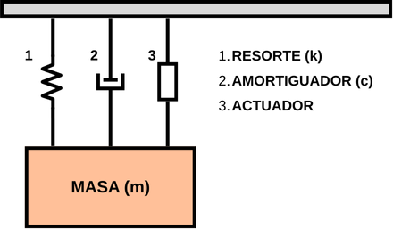
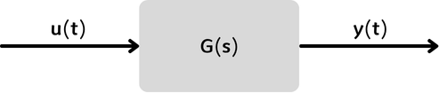
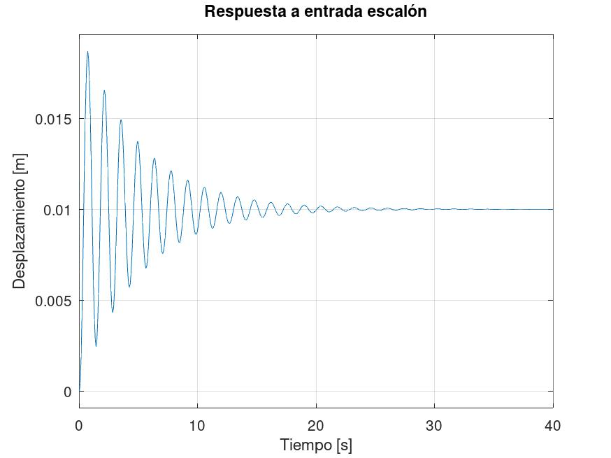
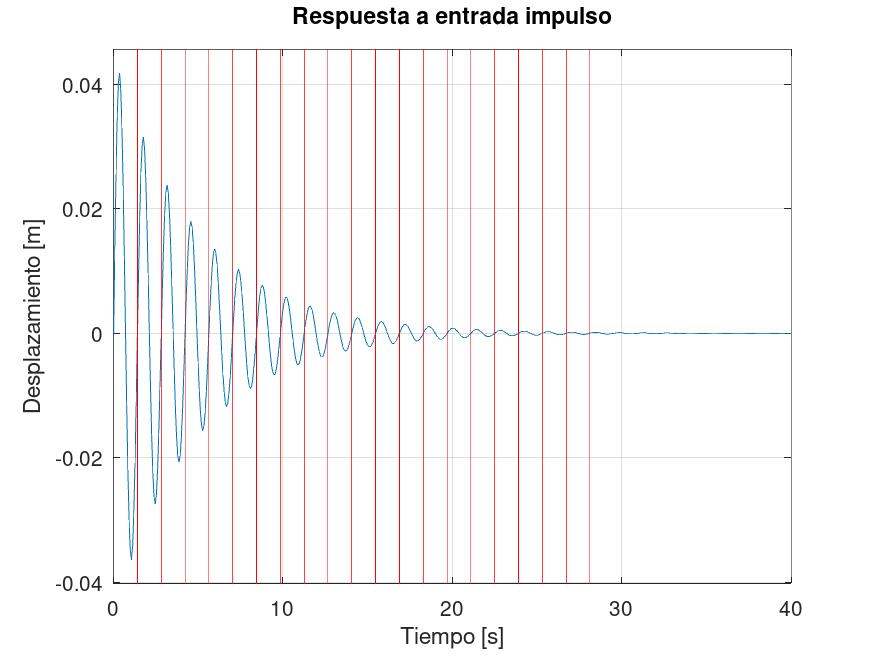
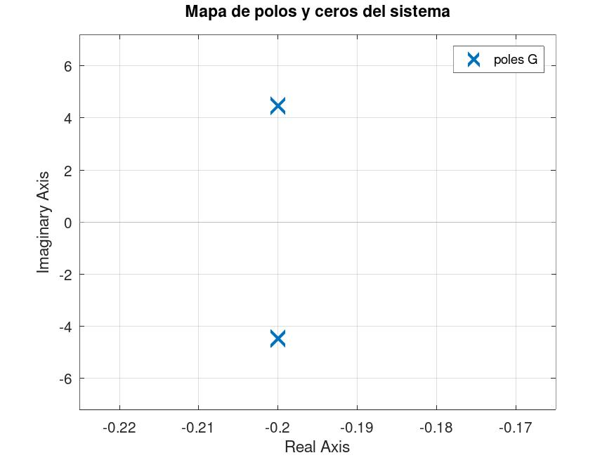
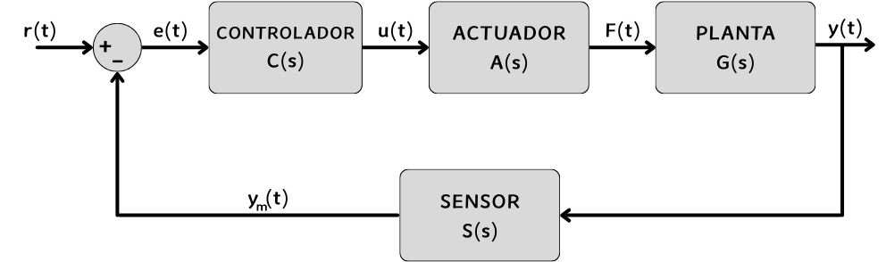
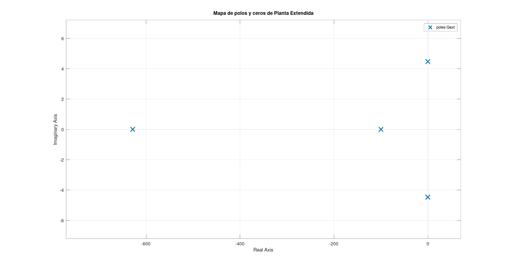

# Trabajo Final Integrador (TFI)

## Sistemas de Control 1

**Integrantes**

- SAILLEN, Simón.
- VARGAS, Rodrigo Sebastian.

## INTRODUCCIÓN

Los sistemas masa–resorte–amortiguador son modelos fundamentales en ingeniería para describir y analizar el comportamiento dinámico de numerosos dispositivos y estructuras. Este tipo de sistema se utiliza para comprender fenómenos de vibración, oscilación y respuesta frente a perturbaciones, su estudio permite diseñar mecanismos que alcancen un equilibrio óptimo entre rapidez de respuesta, estabilidad y amortiguamiento.

En la actualidad, este modelo tiene aplicaciones prácticas en diversas áreas como la suspensión de vehículos, el aislamiento sísmico en edificios, el control de vibraciones en maquinaria industrial o la precisión en equipos de laboratorio. Incorporar un actuador al sistema permite modificar sus parámetros dinámicos en tiempo real, abriendo la puerta a soluciones adaptativas que mejoran el rendimiento y la seguridad. El presente trabajo aborda el modelado, diseño de controlador y simulación de un sistema masa–resorte–amortiguador con actuador, integrando los conocimientos adquiridos en la materia.

## OBJETIVOS

El objetivo de este trabajo práctico es diseñar y controlar un sistema masa–resorte–amortiguador con actuador, capaz de responder de manera óptima frente a perturbaciones y cambios de referencia. Este sistema se utilizará como base para comprender la dinámica de vibraciones mecánicas y el efecto del control en la mejora de su estabilidad y desempeño. El diseño buscará minimizar la sobreoscilación, reducir el tiempo de establecimiento y garantizar un error en estado estacionario mínimo.

### Sistema a Controlar

El sistema consiste en una masa unida a un resorte y un amortiguador dispuestos en serie, con un actuador lineal encargado de aplicar la fuerza de control. El resorte proporciona la fuerza restauradora proporcional a la deformación, mientras que el amortiguador introduce una fuerza disipativa proporcional a la velocidad. El actuador será modelado como una entrada de fuerza controlada electrónicamente.

### Variables de Control y Salida

- Desplazamiento de la Masa: La posición lineal de la masa será la principal variable de salida, medida en metros.  
- Fuerza del Actuador: La señal de control corresponderá a la fuerza ejercida por el actuador, en Newtons.

### Perturbaciones y No Linealidades

- Cargas Externas: Se considerarán fuerzas externas inesperadas que afectan la posición de la masa.  
- Fricción no lineal: Se incluirán efectos de fricción que no siguen una relación lineal con la velocidad.  
- Saturación del Actuador: El actuador tendrá un límite en la fuerza máxima aplicable, lo que puede limitar el rendimiento.

### Niveles de Señal

La entrada del sistema será la fuerza aplicada por el actuador, controlada mediante una señal eléctrica proporcional. La salida será el desplazamiento de la masa, obtenido mediante un sensor de posición lineal.

El objetivo final de este trabajo es desarrollar el modelo matemático del sistema, diseñar un controlador adecuado (como un controlador PD), y simular el comportamiento del sistema controlado en diferentes escenarios. Se espera que el controlador permita que la masa alcance la posición deseada con estabilidad y rapidez, incluso frente a perturbaciones y no linealidades presentes.

## ANÁLISIS DE PLANTA

Analizamos la planta como un sistema *SISO* (*Single Input – Single Output*), debido a que este cuenta con una única entrada (la fuerza sobre la masa) y una única salida (el desplazamiento de la masa); el sistema cuenta con un solo grado de libertad en el eje vertical: una masa suspendida por resorte, un amortiguador y accionada por un actuador lineal que aplica la fuerza de control (estos tres componentes en paralelo).

<div align="center">
  
</div>

Para propósitos de control, la planta se asume causal, estable en lazo abierto, con actuador limitado y con posibles no linealidades suaves. La variable controlada es el desplazamiento vertical medido por un sensor de posición, mientras que la entrada de control es la fuerza suministrada por el actuador.

### Modelo Matemático

La teoría del sistema resorte–masa–amortiguador parte de la segunda ley de Newton: la suma de fuerzas que actúan sobre la masa es igual a su masa por aceleración (F=ma). En nuestro montaje vertical, las fuerzas relevantes son: la del resorte (restauradora), la del amortiguador (disipativa) y una fuerza de actuador que aplicamos como entrada de control. Trabajaremos alrededor de un equilibrio estático, de modo que el peso (P=mg) queda compensado y el análisis se realiza sobre desplazamientos pequeños y(t) respecto de ese equilibrio.

En equilibrio, la suma de fuerzas debe ser igual a:

$$\sum{F(t)}=F_m(t)=ma=m\frac{dv}{dt}=m\frac{d^2y}{dt^2}=m\ddot{y}(t)$$ 

teniendo:

- $F_{resorte}(t)=-ky(t)$
- $F_{amortiguador}(t)=-cv=-c\frac{dy}{dt}=-cy(t)$  
- $F_{actuador}(t)=u(t)$

siendo:

- $c= \text{coeficiente de amortiguación } [\frac{N}{m/s}]$
- $k= \text{cte de resorte } [\frac{N}{m}]$  
- $g= \text{aceleración gravitatoria } =9,8 [m/s^2]$

Entonces el balance dinámico se consigue mediante:

$$m\ddot{y}(t)=-ky(t)-c\dot{y}(t)+u(t)$$

Reordenando para observar mejor la relación entrada–salida del sistema:

$$m\ddot{y}(t)+c\dot{y}(t)+ky(t)=u(t)$$

donde:

- $y(t)$ es la salida del sistema (desplazamiento sobre la masa).  
- $u(t)$ es la entrada del sistema (compensación por el actuador).

Si sumamos una perturbación externa:

$$m\ddot{y}(t)+c\dot{y}(t)+ky(t)=u(t)+d(t)$$

>[!NOTE]
>La razón por la que no aparece el peso ($P=mg$) en la ecuación diferencial es que el análisis se realiza en torno al equilibrio estático. En dicha condición, la fuerza del resorte compensa al peso, y por lo tanto la dinámica de interés se expresa únicamente en función de los desplazamientos relativos $y(t)$ y de la fuerza externa aplicada $u(t)$.

### Función de Transferencia

Partiendo de la ecuación de movimiento planteada, aplicamos la transformada de Laplace (suponiendo condiciones iniciales nulas):

$$m s^2 Y(s)+c s Y(s)+k Y(s)=U(s) \\ [ms^2+cs+k]\cdot Y(s)=U(s)$$

Luego para obtener la función de transferencia debemos hacer:

$$G(s)=\frac{\text{SALIDA}}{\text{ENTRADA}}=\frac{Y(s)}{U(s)}=\frac{1}{ms^2+cs+k}$$

### Valores Iniciales

Se adoptaron los siguientes valores para obtener un caso representativo pero exigente, frecuencia natural baja y bajo amortiguamiento,  produciendo un régimen claramente subamortiguado, con sobreimpulso elevado y tiempos de asentamiento largos. Este escenario permite observar con nitidez las oscilaciones y evidenciar la necesidad de incorporar un actuador para reducir el sobreimpulso y acelerar la convergencia, manteniendo al mismo tiempo una deflexión estática manejable.

Los valores iniciales elegidos son:

- Masa: $m = 5 [Kg]$  
- Rigidez: $k = 100 [N/m]$  
- Amortiguamiento: $c = 2 [\frac{N}{m/s}]$

Derivando de ellos los siguientes valores:

- Frecuencia Natural: $\omega_n=\sqrt{\frac{k}{m}}=4,47 [rad/s]\rightarrow\frac{10[rad/s]}{2\pi}\approx 0,71 [Hz]$
- Razón de Amortiguamiento: $\zeta=\frac{c}{2\sqrt{km}}=0,044$
- Frecuencia Natural Amortiguada: $\omega_d=\omega_n\sqrt{1-\zeta^2}=4,46 [rad/s] \approx 0,70 [Hz]$
- Período Natural: $T_n=\frac{2\pi}{\omega_n [rad/s]}=1,4050 [s]$
- Período Natural Amortiguado: $T_d=\frac{2\pi}{\omega_d [rad/s]}=1,4064 [s]$

Entonces, la función de transferencia queda de la forma:

$$G(s)=\frac{Y(s)}{U(s)}=\frac{1}{ms^2+cs+k}=\frac{1}{5s^2+2s+100}$$

### Diagrama de Bloques Inicial

Si queremos representar el sistema a analizar mediante un Diagrama de Bloques, podemos observar que se trata de un sistema SISO (Single Input – Single Output). La entrada u(t) corresponde a la fuerza aplicada por el actuador, mientras que la salida y(t) representa el desplazamiento de la masa. El bloque central describe la dinámica del sistema masa–resorte–amortiguador, cuya función de transferencia captura el efecto combinado de la inercia, la rigidez y el amortiguamiento.

<div align="center">
  
</div>

### Respuesta Temporal

Para analizar la respuesta temporal del sistema se simularon dos tipos de excitaciones típicas: un escalón unitario y un impulso unitario. El escalón permite observar el comportamiento transitorio y el valor en régimen permanente, mientras que el impulso resalta la dinámica libre del sistema, mostrando su frecuencia natural y amortiguamiento. Estas simulaciones ofrecen un pantallazo inicial de la planta antes de incorporar un actuador.

```MATLAB
close all; clear all; clc;
pkg load control;

% Parámetros del Sistema
m = 5;
k = 100;
c = 2;

% Cálculo de Zeta, Frec. Natural y Frec. Amortiguada
zeta = c / (2*sqrt(k*m))
omega_n = sqrt(k/m)
omega_d = omega_n * sqrt(1 - zeta^2)

% Períodos asociados
Tn = (2*pi) / omega_n
Td = (2*pi) / omega_d

% Función de Transferencia: Fuerza -> Desplazamiento
G = tf(1, [m, c, k]);

% Respuesta a escalón
figure;
step(G);
title("Respuesta a entrada escalón");
xlabel("Tiempo [s]");
ylabel("Desplazamiento [m]");
grid on;

% Respuesta a impulso
figure;
impulse(G);
for i = 1:20
  line ("xdata",[Td*i,Td*i], "ydata",[-1,1], "linewidth", 0.5, "color", "red")
endfor
title("Respuesta a entrada impulso");
xlabel("Tiempo [s]");
ylabel("Desplazamiento [m]");
grid on;
```

>[!NOTE]
>Agregamos líneas verticales en la respuesta al impulso para una mejor observación del periodo natural amortiguado del sistema.

<div align="center">
  
  
</div>

### Estabilidad

Con los parámetros elegidos, el sistema resulta fuertemente subamortiguado. La respuesta al escalón converge al desplazamiento de equilibrio $x=0,01 [m]$, pero presenta un sobreimpulso elevado (de aproximadamente $86,87\%$) y oscilaciones persistentes. El tiempo de asentamiento se ubica en torno a los $20$–$25$ segundos, lo que confirma que el sistema es estable, aunque su dinámica es lenta y con grandes oscilaciones antes de alcanzar el régimen estacionario.

En la respuesta al impulso se observa de manera directa la dinámica libre del sistema, donde se presentan oscilaciones de gran amplitud que decaen lentamente debido al bajo coeficiente de amortiguamiento. Demostrando el carácter subamortiguado del modelo y permite identificar con claridad la frecuencia natural y la tasa de decaimiento, reforzando la conclusión de que el sistema es estable pero con transitorios prolongados.

Para el cálculo del sobreimpulso (overshoot) utilizamos la siguiente fórmula

$$\text{Sobreimpulso} = \frac{(y_{\max} - y_{\infty})}{y_{\infty}} \times 100\%$$

Implementada en el siguiente script:

```MATLAB
% Cálculo de Sobreimpulso (Overshoot)
[x, y] = step(G);
y_max = max(x);
overshoot = ((y_max - 0.01) / 0.01) * 100
```

### Polos Dominantes

Los polos dominantes son aquellos que se encuentran más cercanos al eje imaginario en el plano complejo y son los que determinan el comportamiento dinámico del sistema. En este caso, nuestro sistema no cuenta con ceros y al tratarse de un sistema de segundo orden, sólo existen dos polos, siendo ambos dominantes (ya que no hay otros polos candidatos).

Los polos son los valores de *s* a los que el denominador de la función de transferencia vale cero, siguiendo esta lógica podemos calcular los valores de la siguiente manera:

$$5s^2+2s+100=0$$

Usando la formula de Bhaskara:

- $$\frac{-2+\sqrt{2^2-4\cdot5\cdot100}}{2\cdot5}=\frac{-2+\sqrt{4-2000}}{10}=\frac{-2+\sqrt{-1996}}{10}=-0,2+j4,46$$ 
- $$\frac{-2-\sqrt{2^2-4\cdot5\cdot100}}{2\cdot5}=\frac{-2-\sqrt{4-2000}}{10}=\frac{-2-\sqrt{-1996}}{10}=-0,2-j4,46$$

También podemos observar y graficar dichos polos usando el siguiente script:

```MATLAB
% Polos
figure;
pzmap(G);
title("Mapa de polos y ceros del sistema");
grid on;
```

Teniendo como resultado el siguiente gráfico:

<div align="center">
  
</div>

Podemos concluir entonces que tenemos dos polos dominantes (y únicos), uno en $s=-0,2+j4,46$ y otro en  $s=-0,2-j4,46$, ambos son polos complejos conjugados y junto a la parte real negativa forman un resultado esperable para valores de $0<\zeta<1$, correspondiente a un sistema subamortiguado, estable y con oscilaciones persistentes como el nuestro.

## DISEÑO DE CONTROLADOR

En esta etapa definimos las especificaciones de desempeño que el sistema debe alcanzar mediante la incorporación del actuador, el sensor y el diseño del controlador. El objetivo es mejorar la dinámica de la planta garantizando criterios de rapidez, precisión y estabilidad como un tiempo de establecimiento reducido, un sobreimpulso acotado y un error en régimen permanente mínimo.

Dado que el sistema presenta un comportamiento subamortiguado, con polos complejos conjugados, se requiere un actuador capaz de responder con rapidez y linealidad, siendo el *voice-coil motor (VCM)* o actuador de bobina móvil una opción adecuada por su baja fricción, alta banda de frecuencia y buena relación entre la fuerza aplicada y la señal de entrada, lo que lo convierte en un candidato ideal para implementar control de lazo cerrado y alcanzar los objetivos de diseño.

### Especificaciones de Diseño

- Sobreimpulso: $M_p\leq 10\%$  (objetivo nominal $5\%$).
- Tiempo de Establecimiento (criterio $2\%$): $T_s\leq 1,5 [s]$ (objetivo nominal $1,2 [s]$).
- Error en Estado Estable: $E_s\leq 1\%$.
- Número de Oscilaciones Visibles: $\eta_c=2$ ciclos significativos.  
- Factor de Amortiguamiento: $\zeta \approx 0,2$.

En nuestro sistema, la planta presenta una masa reducida de $5 [Kg]$ y una rigidez de $100 [N/m]$, lo que lleva a una frecuencia natural de $4,47 [rad/s]$, y teniendo un coeficiente de amortiguamiento bajo de $2[N\cdot s/m]$, el sistema resulta subamortiguado con oscilaciones visibles. Estas condiciones permiten que, mediante un actuador de tipo *voice-coil motor* capaz de generar fuerzas del mismo orden de magnitud que las fuerzas elásticas y de amortiguamiento presentes, sea posible incrementar el amortiguamiento efectivo del sistema y modificar la ubicación de los polos dominantes. Por lo tanto, las especificaciones elegidas resultan realizables dentro de este marco físico.

### Diagrama de Bloques Completo

Se ubica al Controlador bajo una configuración en cascada (serie), directamente antes del Actuador, luego esté conectado a la Planta. También agregamos al sistema un Sensor para el cálculo del error que debe corregir el controlador.

<div align="center">
  
</div>

#### Actuador Lineal: Bobina Móvil

Modelamos al actuador como un Motor Voice-Coil (VCM), también conocido como motor de bobina móvil, este tipo de actuadores permiten transformar una señal eléctrica en una fuerza mecánica de manera lineal, rápida y con buena resolución.

Usamos el siguiente modelo:

$$A(s)=\frac{K_a}{\tau_a s + 1}$$

Donde:

- $F(s) = A(s) \cdot U(s)$

Eligiendo los siguientes valores preliminares:

- Ganancia del Actuador: $10 [\frac{N}{V}]$
- Cte. de Tiempo del Actuador: $\tau_a=0,01[s]$

#### Sensor de Posición: Potenciómetro Lineal

Modelamos al sensor como un potenciómetro lineal. Se trata de un dispositivo simple, económico y de amplia disponibilidad que entrega una tensión proporcional al desplazamiento, lo que puede representarse como una ganancia estática junto con una dinámica de primer orden que aproxima las limitaciones eléctricas del sistema de medición.

Usamos el siguiente modelo:  

$$S(s)=\frac{K_s}{\tau_s s + 1}$$

Donde:

- $y_m(s)=S(s)\cdot Y(s)$  
- $e(t)=r(t)-y_m(t)$

Eligiendo los siguientes valores preliminares:

- Ganancia del Sensor: $K_s=1$ [adimensional]
- Ancho de Banda: $fc=100[Hz]$  
- Cte de Tiempo del Sensor: $\tau_s=1/(2\pi f_c)=1,5910 \times 10^{-3} [s]$

#### Planta Extendida sin Controlador

Luego de agregar al actuador y al sensor, la planta extendida queda de la siguiente forma:

$$Gext(s)=A(s)\cdot S(s)\cdot G(s)=\frac{K_a}{\tau_a s + 1} \cdot \frac{K_s}{\tau_s s + 1} \cdot \frac{1}{m s^2 + c s + k} \\
Gext(s)=\frac{10}{(0,01s+1)((1,59 \times 10^{-3})s+1)(5s^2+2s+100)}$$

##### Polos Agregados

Al utilizar la Planta Extendida para el diseño del controlador, hemos introducido 2 nuevos polos a la planta, siendo estos los correspondientes al Sensor y al Actuador, los mismos se pueden calcular de manera sencilla, quedando así los siguientes polos:

- Polos de la Planta (2 – dominantes): $s=-0,2\plusmn j 4,46$
- Polo del Sensor (1): $s=-1/\tau_s=-628,9$  
- Polo del Actuador (1): $s=-1/\tau_a=-100$

Estos valores pueden ser vistos y comprobados mediante el siguiente script:

```MATLAB
% Parametros Sensor
Ks = 1;
fc = 100;
tau_s = 1 / (2 * pi * fc)

% Parametros Actuador
Ka = 10;
tau_a = 0.01;

% Planta Extendida
S = tf(Ks, [tau_s, 1]);
A = tf(Ka, [tau_a, 1]);
Gext = A * S * G;

% Polos Planta Extendida
pole(Gext)
figure;
pzmap(Gext);
title("Mapa de polos y ceros de Planta Extendida");
grid on;
```

<div align="center">
  
</div>

```terminal
>> pole(Gext)
ans =

  -628.3185 +        0i
  -100.0000 +        0i
    -0.2000 +   4.4677i
    -0.2000 -   4.4677i

>>
```

Como se puede observar, ahora la planta extendida cuenta con 4 polos, permaneciendo como polos dominantes los polos de la planta original, también, para corroborar los valores calculados, utilizamos la función pole(Gext).

### Controlador de Adelanto–Atraso (PID)

Para mejorar el desempeño del sistema y cumplir con las especificaciones de tiempo de asentamiento y sobreimpulso decidimos por implementar un controlador PID (Proporcional–Integral–Derivativo). El controlador PID combina tres acciones de control: la constante proporcional ($K_p$) determina la rapidez del sistema, la constante integral ($K_i$) garantiza que la salida alcance la referencia sin perturbaciones y la constante derivativa ($K_d$) mejora el amortiguamiento y reduce el sobreimpulso.

Función de Transferencia del Controlador (factorizada):

$$G_C(s)=_d s^2 + K_p s + K_i = \frac{K_d}{s}\times (s^2 + \frac{K_p}{K_d} s + \frac{K_i}{K_d})$$

#### Método de Diseño: Cancelación de Polos Dominantes

El objetivo es cancelar los polos dominantes de la planta mediante la inserción de ceros del controlador PID, e introducir el integrador ($1/s$) del PID para eliminar el error de estado estacionario.

##### Paso 1: Obtener la Func. de Transferencia de la Planta (factorizada)

La función de transferencia de la Planta Extendida es la siguiente:

$$G_{ext}(s)=\frac{K_a K_s}{(\tau_a s+1)(\tau_s s+1)(m s^2 + c s + k)}$$

Los polos dominantes complejos a cancelar provienen del término cuadrático $(ms^2+cs+k)$, factorizando m del término cuadrático en el denominador queda:

$$G_{ext}(s)=\frac{K_a K_s}{(\tau_a s+1)(\tau_s s+1)\cdot m(s^2 + \frac{c}{m} s + \frac{k}{m})}$$

Teniendo $\zeta=\frac{c}{2\sqrt{mk}}$ y $\omega_n=\sqrt{\frac{k}{m}}$ podemos expresar la TF en su forma canónica:


$$G_{ext}(s)=\frac{K_a K_s}{(\tau_a s+1)(\tau_s s+1)\cdot m[s^2 + \frac{c}{m} s + \frac{k}{m}]}=[\frac{1}{s^2 + 2 \zeta \omega_n s + \omega_n^2}]\cdot [\frac{(K_a K_s)/m}{(\tau_a s+1)(\tau_s s+1)}]$$

TBD...